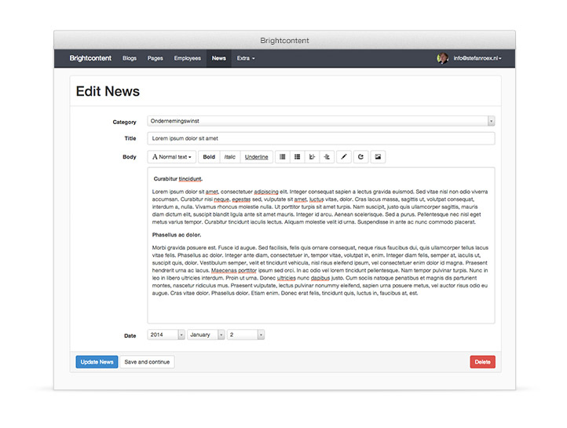

Brightcontent
=============

[](http://badge.fury.io/rb/brightcontent)
[](https://codeclimate.com/github/stexy/brightcontent)
[](https://travis-ci.org/stefanroex/brightcontent)

Brightcontent, yet another rails CMS / admin panel

* For *developers*, to make a *custom CMS* for *non-technical users*
* No standard 'cms-modules', we hate those, making custom is easy enough
* Build in the rails way, use your normals models, only controllers and views are provided
* Only exception: Page model is provided with tree structure, sorting, hidden and pretty urls like `/services/cleaning/houses`
* Rails 4 only
* Strong Parameters support


Installation
------------

Include the gem in your Gemfile:

```ruby
gem "brightcontent"
bundle install
```

Generate the initializer, copy migrations and edit routes file. This can be done via a generator. Migrate the database afterwards:

    $ rails generate brightcontent:install
    $ rails generate brightcontent:pages:install
    $ rails generate brightcontent:attachments:install
    $ rake db:migrate

Go to `/admin` and login with default user (email: `admin@example.com` / password: `password`).

Add a resource to Brightcontent
-------------------------------

Lets say, we want to add projects. Just create the `Project` model the rails way:
    $ rails g model Project name:string description:text
    $ rake db:migrate

To add the resource to brightcontent run:

    $ rails generate brightcontent:resource Project

Gratz! Projects can now be controlled with Brightcontent.

Pages
-----

Pages gives you a Page model with tree structure and pretty urls. Every page relates to a specific path. For example, you could create a page with the path `/about/team`. The page is available on the url via `current_page`.

This adds an extra layer on top of your existing routes. However when there aren't any routes available for the specific url, Rails cannot render the page. Therefore it is best to add a catch-all route (at the very bottom of the file) for all general pages:

```ruby
get "*path" => "pages#show", constraints: Brightcontent::Pages::PathConstraint.new
```
